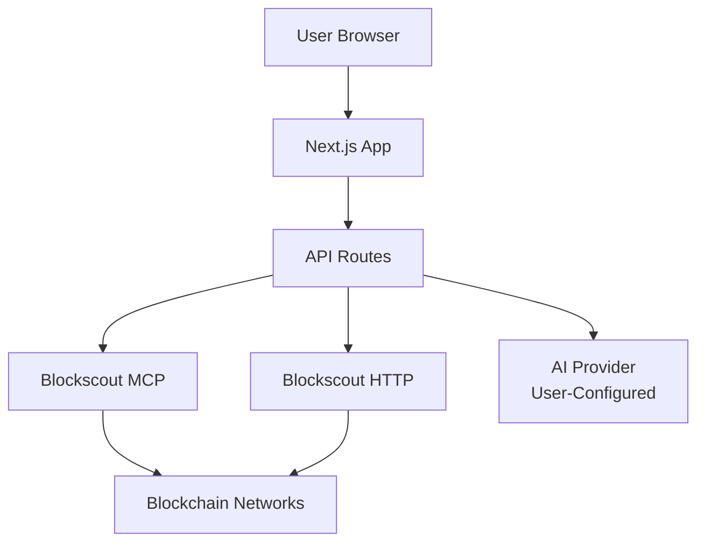
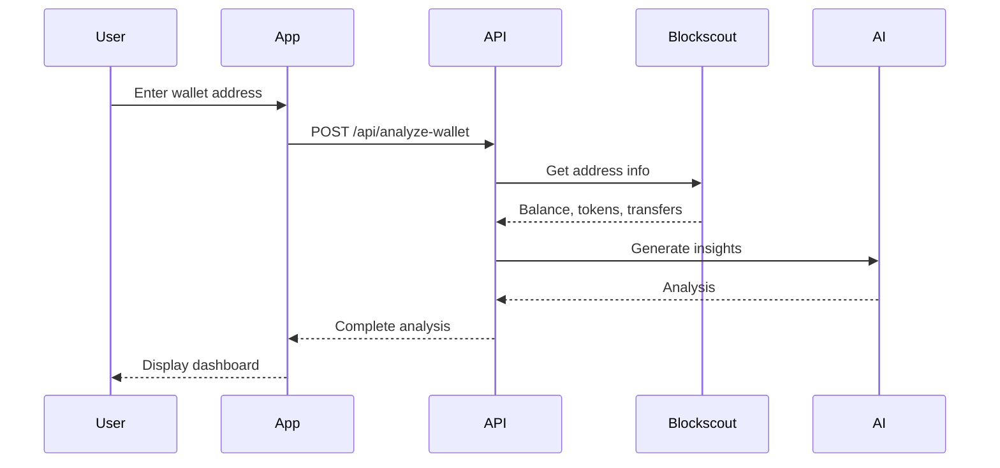

# 🐋 ChainWhale

> AI-powered blockchain analytics for intelligent wallet analysis and whale tracking


## Table of Contents

- [Features](#-features)
- [Quick Start](#-quick-start)
- [Architecture](#-architecture)
- [Tech Stack](#️-tech-stack)
- [API Documentation](#-api-documentation)
- [Development](#-development)
- [Deployment](#-deployment)
- [License](#-license)

## ✨ Features

- **🐋 Whale Tracker** - Real-time monitoring of large transfers ($10K+) across 5 chains
- **💼 Wallet Analysis** - Comprehensive portfolio breakdown with risk scoring
- **💬 AI Chat** - Natural language blockchain queries with customizable AI models
- **📊 Multi-Chain** - Ethereum, Base, Arbitrum, Optimism, Polygon
- **🔐 Privacy-First** - Client-side API key storage

## 🚀 Quick Start

```bash
# Install dependencies
pnpm install

# Run development server
pnpm dev
```

**Visit:** [http://localhost:3000](http://localhost:3000)

> **💡 AI Configuration:** Navigate to Settings to add your AI API key (OpenAI, Anthropic, or any compatible provider) to enable AI-powered insights.

### Prerequisites

- Node.js 20+
- pnpm 9+
- Docker (optional, for MCP server)

### Configuration

```bash
# Optional: Create .env.local
BLOCKSCOUT_USE_HTTP=true        # Force HTTP-only mode
BLOCKSCOUT_MCP_FIRST=false      # Disable MCP preference
OPENAI_API_KEY=sk-...           # Server-side AI key (optional, users configure via Settings)
```

## 🏗️ Architecture

### System Overview



### Component Structure

```
src/
├── app/
│   ├── dashboard/              # Main dashboard page
│   ├── whales/                 # Whale tracker page
│   └── api/                    # API routes
│       ├── analyze-wallet/     # Wallet analysis endpoint
│       └── whale-tracker/      # Whale feed endpoint
│
├── components/
│   ├── dashboard/              # Dashboard components
│   │   └── wallet/             # Wallet analysis UI
│   └── features/               # Feature-specific components
│
├── core/
│   ├── hooks/                  # Custom React hooks
│   ├── services/               # Business logic
│   └── utils/                  # Helper functions
│
└── lib/
    ├── blockscout/             # Blockchain data client
    │   ├── mcp-client.ts       # MCP integration
    │   ├── http-client.ts      # REST API client
    │   └── hybrid-client.ts    # MCP-first with fallback
    └── ai/                     # AI integration
        └── client.ts           # OpenAI wrapper
```

### Data Flow



## 🛠️ Tech Stack

| Category | Technologies |
|----------|-------------|
| **Frontend** | Next.js 15.5.4, React 19, TypeScript 5.0 |
| **Styling** | Tailwind CSS 4.x, shadcn/ui |
| **Data** | Blockscout MCP Server, Blockscout REST API v2 |
| **AI** | Customizable (OpenAI, Anthropic, etc.), Model Context Protocol SDK |
| **Testing** | Playwright, Vitest |
| **Deployment** | Vercel |

<details>
<summary><b>📖 Detailed Architecture & Integration</b></summary>

## Blockscout Integration

ChainWhale uses a **hybrid MCP-first approach** for blockchain data:

### Whale Tracker

**Data Source:** Blockscout MCP Server (primary) + REST API v2 (fallback)

**Supported Chains:**
- Ethereum (1), Base (8453), Arbitrum (42161), Optimism (10), Polygon (137)

**Features:**
- Real-time monitoring of 9 whale addresses
- Advanced filters: time range, value threshold, token type
- Top whales leaderboard
- MCP data source badges
- Transaction explorer links

**MCP Tools:**
- `get_token_transfers_by_address` - ERC-20 transfers
- `get_address_info` - Wallet metadata
- `get_tokens_by_address` - Token holdings

### Wallet Analysis

**Data Source:** Blockscout MCP Server (primary) + REST API v2 (fallback)

**Features:**
- Multi-chain portfolio analysis
- ENS name resolution
- Token holdings with USD values
- Transaction history (24h)
- Whale detection & categorization
- AI-powered risk scoring
- Block explorer integration

**MCP Tools:**
- `get_address_info` - Balance, ENS, contract status
- `get_tokens_by_address` - ERC-20 holdings
- `get_token_transfers_by_address` - Recent transfers

### AI Chat

**AI Provider:** User-configured (supports any AI API)

**Supported Models:**
- OpenAI (GPT-4, GPT-4o, GPT-3.5-turbo)
- Anthropic (Claude 3.5 Sonnet, Claude 3 Opus)
- Any OpenAI-compatible API

**Configuration:** Users add their own API key via Settings page

**Features:**
- Natural language blockchain queries
- Cross-chain transaction analysis
- Market trend insights
- Smart contract analysis

</details>

## 📚 API Documentation

### Whale Tracker

**GET** `/api/whale-tracker/feed`

```typescript
// Query Parameters
chains: string[]        // Chain IDs (1, 8453, 42161, 10, 137)
timeRange: string       // '1h' | '6h' | '24h' | '7d'
minValue: number        // Minimum USD value
token?: string          // Optional token filter

// Response
{
  transfers: Transfer[],
  stats: { total, volume, largest, uniqueWhales },
  topWhales: Whale[],
  metadata: { timestamp, dataSource }
}
```

### Wallet Analysis

**POST** `/api/analyze-wallet`

```typescript
// Request
{
  address: string,      // Wallet address or ENS
  chains: string[]      // Chain IDs to analyze
}

// Response
{
  analysis: WalletAnalysis,
  holdings: TokenHolding[],
  ensName?: string,
  recentTransactions: Transaction[]
}
```

**POST** `/api/analyze-wallet-ai`

```typescript
// Request
{
  address: string,
  holdings: TokenHolding[],
  recentTransactions: Transaction[],
  totalValue: number,
  chains: Record<string, number>,
  apiKey: string        // User's AI API key (OpenAI, Anthropic, etc.)
}

// Response
{
  insights: string,     // AI-generated analysis
  riskScore?: number,
  summary?: string
}
```

## 🛠️ Development

```bash
# Run development server
pnpm dev

# Run tests
pnpm test

# Run E2E tests
pnpm test:e2e

# Lint code
pnpm lint

# Build for production
pnpm build

# Start production server
pnpm start
```

### Docker Setup (Optional)

```bash
# Start Blockscout MCP Server
docker run -d \
  --name blockscout-mcp \
  -p 3000:3000 \
  ghcr.io/blockscout/mcp-server:latest
```

## 🚢 Deployment

### Vercel (Recommended)

[](https://vercel.com/new/clone?repository-url=https://github.com/ChainsQueen/chainwhale)

1. Import repository to Vercel
2. Configure build settings (auto-detected):
   - **Build Command:** `pnpm build`
   - **Install Command:** `pnpm install`
3. (Optional) Add environment variables:
   - `OPENAI_API_KEY` - Server-side AI key (optional, users can add their own via Settings)
   - `BLOCKSCOUT_USE_HTTP=true` - Force HTTP mode
4. Deploy

**Note:** Docker/MCP not required in production - uses HTTP client automatically.

### Environment Variables

| Variable | Description | Default |
|----------|-------------|----------|
| `BLOCKSCOUT_MCP_FIRST` | Enable MCP-first hybrid mode | `true` |
| `BLOCKSCOUT_USE_HTTP` | Force HTTP-only mode | `false` |
| `OPENAI_API_KEY` | Server-side AI key (optional, users can configure their own) | - |

## 📄 License

MIT License - see [LICENSE](./LICENSE)

---

**Built with ❤️ using Next.js, Blockscout MCP, and customizable AI**