<div align="center">
  
  <h1>ChainWhale</h1>
  <p><em>AI-powered blockchain analytics for intelligent wallet analysis and whale tracking</em></p>
</div>


## Table of Contents

- [Features](#-features)
- [Quick Start](#-quick-start)
- [Architecture](#-architecture)
- [Tech Stack](#️-tech-stack)
- [API Documentation](#-api-documentation)
- [Development](#-development)
- [Deployment](#-deployment)
- [License](#-license)

## ✨ Features

- **🐋 Whale Tracker** - Real-time monitoring of large transfers ($10K+) across 5 chains
- **💼 Wallet Analysis** - Comprehensive portfolio breakdown with risk scoring
- **💬 AI Chat** - Natural language blockchain queries with customizable AI models
- **📊 Multi-Chain** - Ethereum, Base, Arbitrum, Optimism, Polygon
- **🔐 Privacy-First** - Client-side API key storage

## 🚀 Quick Start

```bash
# Install dependencies
pnpm install

# Run development server
pnpm dev
```

**Visit:** [http://localhost:3000](http://localhost:3000)

> **💡 AI Configuration:** Navigate to Settings to add your AI API key (OpenAI, Anthropic, or any compatible provider) to enable AI-powered insights.

### Prerequisites

- Node.js 20+
- pnpm 9+
- Docker (optional, for MCP server)

### Configuration

```bash
# Optional: Create .env.local
BLOCKSCOUT_USE_HTTP=true        # Force HTTP-only mode
BLOCKSCOUT_MCP_FIRST=false      # Disable MCP preference
OPENAI_API_KEY=sk-...           # Server-side AI key (optional, users configure via Settings)
```

## 🏗️ Architecture

### System Overview


### Component Structure

```
src/
├── app/
│   ├── dashboard/              # Main dashboard page
│   ├── whales/                 # Whale tracker page
│   ├── page.tsx                # Home page
│   ├── layout.tsx              # Root layout
│   ├── globals.css             # Global styles
│   └── api/                    # API routes
│       ├── analyze-wallet/     # Wallet analysis endpoint
│       ├── analyze-wallet-ai/  # Wallet AI insights endpoint
│       ├── chat/               # AI chat endpoint
│       ├── test-openai-key/    # API key validation
│       └── whale-tracker/      # Whale tracker endpoints
│           ├── feed/           # Main whale transfer feed
│           ├── analyze-ai/     # AI insights generation
│           ├── contract-info/  # Token contract details
│           └── contract-security/ # Contract security data (20+ fields)
│
├── components/
│   ├── dashboard/              # Dashboard components
│   │   ├── wallet/             # Wallet analysis UI components
│   │   │   ├── wallet-overview.tsx
│   │   │   ├── wallet-overview-section.tsx
│   │   │   ├── whale-detection-section.tsx
│   │   │   ├── risk-assessment-section.tsx
│   │   │   ├── token-holdings-section.tsx
│   │   │   └── recent-activity-section.tsx
│   │   ├── api-settings.tsx    # AI provider configuration (OpenAI, Anthropic, Google)
│   │   ├── chat-interface.tsx  # AI chat UI
│   │   └── wallet-analysis.tsx # Main wallet analysis component
│   ├── features/               # Feature-specific components
│   │   ├── contract/           # Contract info components
│   │   │   ├── contract-info-dialog.tsx
│   │   │   └── contract-info-button.tsx
│   │   ├── data-source/        # MCP/HTTP data source badges
│   │   │   └── data-source-card.tsx
│   │   └── whale/              # Whale tracker components
│   │       ├── whale-tracker-card.tsx
│   │       ├── whale-stats.tsx
│   │       ├── whale-filters.tsx
│   │       ├── whale-top-leaderboard.tsx
│   │       ├── ai-insights-card.tsx
│   │       └── ai-insights-checklist-dialog.tsx
│   ├── layouts/                # Layout components
│   │   ├── header.tsx
│   │   └── sidebar.tsx
│   └── ui/                     # shadcn/ui components (24 files)
│       ├── button.tsx, card.tsx, dialog.tsx, etc.
│       └── value-display.tsx   # Custom token amount formatter
│
├── core/
│   ├── constants/              # App constants
│   │   ├── chains.ts           # Chain configurations (5 chains)
│   │   └── whale-addresses.ts  # Known whale addresses (9 whales)
│   ├── hooks/                  # Custom React hooks (8 hooks)
│   │   ├── use-whale-feed.ts   # Whale feed data fetching
│   │   ├── use-whale-ai.ts     # AI insights generation
│   │   ├── use-whale-filters.ts # Filter state management
│   │   └── use-wallet-analysis.ts # Wallet analysis logic
│   ├── services/               # Business logic
│   │   ├── whale-service.ts    # Whale tracking service
│   │   └── wallet-service.ts   # Wallet analysis service
│   ├── types/                  # TypeScript type definitions
│   │   ├── whale.ts            # Whale-related types
│   │   ├── wallet.ts           # Wallet-related types
│   │   └── ai.ts               # AI-related types
│   └── utils/                  # Helper functions
│       └── wallet-utils.ts     # Wallet utility functions
│
└── lib/
    ├── blockscout/             # Blockchain data client
    │   ├── client.ts           # MCP client (primary)
    │   ├── http-client.ts      # REST API client (fallback)
    │   ├── hybrid-client.ts    # MCP-first with HTTP fallback
    │   ├── factory.ts          # Client factory (env-based selection)
    │   └── index.ts            # Exports
    ├── ai/                     # AI integration
    │   ├── client.ts           # Multi-provider AI engine
    │   │                       # (OpenAI, Anthropic, Google, Custom)
    │   └── index.ts            # Exports
    ├── shared/                 # Shared types & utilities
    │   └── types.ts            # Common TypeScript types
    └── utils.ts                # Utility functions
```

### Data Flow

> **Note:** The following diagrams show the data flow for the **Whale Tracker** feature. Wallet Analysis and Chat flows will be documented separately.

#### 1. Whale Transfer Feed Flow

```mermaid
sequenceDiagram
    participant User
    participant Page as Whale Tracker Page<br/>(whales/page.tsx)
    participant Hook as useWhaleFeed Hook<br/>(use-whale-feed.ts)
    participant Route as API Route<br/>(whale-tracker/feed/route.ts)
    participant Client as HTTP Client<br/>(http-client.ts)
    participant Blockscout as Blockscout API<br/>(*.blockscout.com)

    User->>Page: Visit /whales page
    activate Page
    Note over Page: Set filters:<br/>chains, timeRange,<br/>minValue, token
    
    Page->>Hook: useWhaleFeed(filters)
    activate Hook
    Note over Hook: Auto-refresh every 30s
    
    Hook->>Route: GET /api/whale-tracker/feed<br/>?chains=1,8453&timeRange=24h&minValue=10000
    activate Route
    Note over Route: Validate params<br/>Parse filters
    
    loop For each chain
        Route->>Client: getTokenTransfers(chainId, whaleAddress, ageFrom, ageTo)
        activate Client
        Note over Client: Construct URL<br/>Add retry logic<br/>Filter by time range
        
        Client->>Blockscout: GET /api/v2/addresses/{whale}/token-transfers
        activate Blockscout
        Note over Blockscout: Fetch transfers:<br/>• transaction_hash<br/>• from/to addresses<br/>• token info<br/>• value & decimals<br/>• timestamp
        
        Blockscout-->>Client: Transfer array
        deactivate Blockscout
        
        Client-->>Route: TokenTransfer[]
        deactivate Client
    end
    
    Note over Route: Aggregate transfers<br/>Calculate stats<br/>Build top whales<br/>Sort by value
    
    Route-->>Hook: { transfers, stats, topWhales }
    deactivate Route
    
    Hook-->>Page: Feed data
    deactivate Hook
    
    Note over Page: Render:<br/>📊 Stats cards<br/>🐋 Transfer list<br/>🏆 Top whales
    
    Page-->>User: Display whale tracker
    deactivate Page
```



**Key Files:**
- **Page**: `/src/app/whales/page.tsx`
- **Hook**: `/src/core/hooks/use-whale-feed.ts`
- **API**: `/src/app/api/whale-tracker/feed/route.ts`
- **MCP Client**: `/src/lib/blockscout/mcp-client.ts` (primary)
- **HTTP Client**: `/src/lib/blockscout/http-client.ts` (fallback)
- **Hybrid Client**: `/src/lib/blockscout/hybrid-client.ts` (orchestrator)

**Blockscout MCP Tool (Primary):**
```
mcp1_get_token_transfers_by_address(
  chain_id: "1",
  address: "0x28C6c06298d514Db089934071355E5743bf21d60",
  age_from: "2025-01-19T00:00:00Z",
  age_to: "2025-01-20T00:00:00Z",
  token: null  // Optional: filter by specific token
)
```

**Blockscout HTTP API (Fallback):**
```
GET https://{chain}.blockscout.com/api/v2/addresses/{whaleAddress}/token-transfers?type=ERC-20
```

**Example Request:**
```
GET https://eth.blockscout.com/api/v2/addresses/0x28C6c06298d514Db089934071355E5743bf21d60/token-transfers?type=ERC-20
```

**Response Data:**
- `transaction_hash` - Transaction ID
- `from.hash` / `to.hash` - Sender/receiver addresses
- `token.symbol`, `token.name` - Token info
- `total.value`, `total.decimals` - Transfer amount
- `timestamp` - Transfer time
- `token.exchange_rate` - USD price (if available)

**Data Source Strategy:**
1. **MCP First** - Attempts Blockscout MCP server (Docker-based, local/dev)
2. **HTTP Fallback** - Falls back to REST API if MCP unavailable (production)
3. **Automatic** - Hybrid client handles switching transparently

**Data Flow:**
1. User sets filters (chains, time range, min value)
2. Hook fetches from API with auto-refresh every 30s
3. API loops through 9 whale addresses on each selected chain
4. HTTP client requests transfers from Blockscout (with retry logic)
5. API aggregates transfers, calculates stats, builds leaderboard
6. Page renders feed with stats cards and top whales

---

#### 2. Token Contract Details Flow

```mermaid
sequenceDiagram
    participant User
    participant Dialog as Contract Dialog<br/>(contract-info-dialog.tsx)
    participant Route as API Route<br/>(contract-info/route.ts)
    participant Client as HTTP Client<br/>(http-client.ts)
    participant Blockscout as Blockscout API<br/>(eth.blockscout.com)

    User->>Dialog: Click contract info icon
    activate Dialog
    Note over Dialog: Props: tokenAddress, chainId, chainName
    
    Dialog->>Route: GET /api/whale-tracker/contract-info<br/>?address=0x...&chainId=1
    activate Route
    Note over Route: Validate params
    
    Route->>Client: getAddressInfo(chainId, address)
    activate Client
    Note over Client: Construct URL<br/>Add retry logic<br/>10s timeout
    
    Client->>Blockscout: GET /api/v2/addresses/{address}
    activate Blockscout
    Note over Blockscout: Fetch contract data:<br/>• is_verified<br/>• token metadata<br/>• holders_count<br/>• exchange_rate<br/>• market_cap<br/>• creator_address
    
    Blockscout-->>Client: Raw blockchain data
    deactivate Blockscout
    Note over Client: Transform response:<br/>holders_count → holders<br/>Type-safe conversion
    
    Client-->>Route: AddressInfo object
    deactivate Client
    Note over Route: Transform to clean API:<br/>is_verified → isVerified<br/>holders → holderCount<br/>exchange_rate → tokenPrice
    
    Route-->>Dialog: Contract info JSON
    deactivate Route
    Note over Dialog: Render UI sections:<br/>✓ Security badges<br/>💰 Price & market data<br/>👥 Holder count<br/>🔗 Explorer links
    
    Dialog-->>User: Display contract details
    deactivate Dialog
```



**Key Files:**
- **UI**: `/src/components/features/contract/contract-info-dialog.tsx`
- **API**: `/src/app/api/whale-tracker/contract-info/route.ts`
- **MCP Client**: `/src/lib/blockscout/mcp-client.ts` (primary)
- **HTTP Client**: `/src/lib/blockscout/http-client.ts` (fallback)
- **Types**: `/src/lib/shared/types.ts`

**Blockscout MCP Tool (Primary):**
```
mcp1_get_address_info(
  chain_id: "1",
  address: "0xdAC17F958D2ee523a2206206994597C13D831ec7"
)
```

**Blockscout HTTP API (Fallback):**
```
GET https://{chain}.blockscout.com/api/v2/addresses/{contractAddress}
```

**Example Request:**
```
GET https://eth.blockscout.com/api/v2/addresses/0xdAC17F958D2ee523a2206206994597C13D831ec7
```

**Response Data:**
- `is_verified` - Contract source code verification status
- `is_scam` - Scam detection flag
- `implementations[]` - Proxy implementation addresses
- `token.type` - Token standard (ERC-20, ERC-721, etc.)
- `token.holders_count` - Number of token holders
- `token.total_supply` - Total token supply
- `token.exchange_rate` - Current USD price per token
- `token.circulating_market_cap` - Market capitalization
- `token.volume_24h` - 24-hour trading volume
- `token.icon_url` - Token logo URL
- `creator_address_hash` - Contract deployer address
- `creation_transaction_hash` - Deployment transaction

**Data Source Strategy:**
1. **MCP First** - Uses MCP tool for enriched data with better performance
2. **HTTP Fallback** - Production environments use HTTP client directly
3. **Note**: Currently using HTTP-only in production (MCP requires Docker)

**Data Sources:**
1. **Props** (from parent) - Basic token info: address, symbol, chain
2. **Blockscout API** (fetched) - Contract verification, market data, holders, creator
3. **Computed** (client-side) - Explorer URLs, formatted numbers, badge states

---

#### 4. Blockscout MCP Data Flow (Internal Architecture)

> **Important:** This diagram shows the internal architecture of how the Blockscout MCP Server processes requests. This is the foundation that powers all blockchain data features in ChainWhale.

```mermaid
sequenceDiagram
    participant App as ChainWhale App<br/>(Your Code)
    participant MCP as MCP Server<br/>(Docker Container)
    participant CS as Chainscout<br/>(chains.blockscout.com)
    participant BS as Blockscout Instance<br/>(eth.blockscout.com)
    participant Meta as Metadata Service<br/>(metadata.services.blockscout.com)

    Note over App: User requests address info<br/>(e.g., USDT contract)
    
    App->>MCP: 📤 SEND: get_address_info<br/>{ chain_id: "1", address: "0xdAC..." }
    activate MCP
    Note over MCP: MCP Server receives request<br/>via JSON-RPC 2.0
    
    par Concurrent API Calls (Performance Optimization)
        MCP->>CS: GET /api/chains/1
        activate CS
        Note over CS: Returns chain metadata:<br/>• Blockscout instance URL<br/>• Native currency info<br/>• Chain configuration
        CS-->>MCP: Chain metadata
        deactivate CS
        
        MCP->>BS: GET /api/v2/addresses/0xdAC...
        activate BS
        Note over BS: Returns blockchain data:<br/>• Balance & transactions<br/>• Contract verification<br/>• Token metadata<br/>• Creator address<br/>• Proxy information
        BS-->>MCP: Address data
        deactivate BS
        
        MCP->>Meta: GET /api/v1/metadata?addresses=0xdAC...&chainId=1
        activate Meta
        Note over Meta: Returns enriched data:<br/>• Public tags<br/>• Reputation score<br/>• Verified domains<br/>• Security flags
        Meta-->>MCP: Metadata tags
        deactivate Meta
    end
    
    Note over MCP: Combines all 3 responses<br/>into unified structure
    
    MCP->>App: 📥 RECEIVE: Combined response<br/>{ data: { basic_info: {...}, metadata: {...} } }
    deactivate MCP
    
    Note over App: Parse and display:<br/>✅ Verified status<br/>💰 Price & market cap<br/>👥 Holder count<br/>🏷️ Tags & reputation
```



**Key Points:**

1. **Single Request → 3 API Calls**
   - Your app sends 1 request with 2 parameters
   - MCP server makes 3 concurrent API calls
   - Returns combined data from all sources

2. **Data Sources**
   - **Chainscout**: Chain configuration and Blockscout instance URLs
   - **Blockscout API**: Primary blockchain data (balance, tokens, contracts)
   - **Metadata Service**: Enrichment (tags, reputation, verified domains)

3. **Response Structure**
   ```json
   {
     "data": {
       "basic_info": {
         "hash": "0xdAC17F958D2ee523a2206206994597C13D831ec7",
         "is_contract": true,
         "is_verified": true,
         "is_scam": false,
         "reputation": "ok",
         "coin_balance": "42",
         "exchange_rate": "3877.23",
         "token": {
           "symbol": "USDT",
           "name": "Tether",
           "decimals": "6",
           "holders_count": "10645873",
           "exchange_rate": "1.001",
           "circulating_market_cap": "182046749182.5312",
           "volume_24h": "101914911777.51366"
         }
       },
       "metadata": {
         "tags": [
           { "name": "USDT Stablecoin", "slug": "usdt-stablecoin-1" },
           { "name": "Token Contract", "slug": "token-contract" },
           { "name": "Stablecoin", "slug": "stablecoin" }
         ]
       }
     }
   }
   ```

4. **Performance Benefits**
   - **Concurrent requests**: All 3 APIs called in parallel
   - **Single connection**: One MCP request instead of 3 HTTP calls
   - **Enriched data**: Automatic metadata augmentation
   - **Caching**: MCP server caches chain metadata

5. **MCP Tools Used**
   - `get_address_info` - Address and contract information
   - `get_token_transfers_by_address` - Token transfer history
   - `get_tokens_by_address` - Token holdings
   - `get_transaction_info` - Transaction details

**Implementation Files:**
- **MCP Client**: `/src/lib/blockscout/client.ts`
- **HTTP Client**: `/src/lib/blockscout/http-client.ts` (fallback)
- **Hybrid Client**: `/src/lib/blockscout/hybrid-client.ts` (orchestrator)
- **Factory**: `/src/lib/blockscout/factory.ts` (client selection)

**Environment Modes:**
- **Development**: Uses MCP client (requires Docker)
- **Production**: Uses HTTP client (Vercel-compatible)
- **Hybrid**: Tries MCP first, falls back to HTTP

---

#### 3. Whale Tracker AI Analysis Flow


**Key Files:**
- **Page**: `/src/app/whales/page.tsx`
- **Hook**: `/src/core/hooks/use-whale-ai.ts`
- **API**: `/src/app/api/whale-tracker/analyze-ai/route.ts`
- **AI Client**: `/src/lib/ai/client.ts`

**AI Provider Endpoint:**
```
POST https://api.openai.com/v1/chat/completions
```
*Or any compatible AI provider (Anthropic, custom, etc.)*

**Request Headers:**
```
Authorization: Bearer {userApiKey}
Content-Type: application/json
```

**Data Sent to AI:**
```typescript
{
  transfers: [
    {
      token: { 
        symbol: "USDT", 
        name: "Tether",
        address: "0xdAC17F958D2ee523a2206206994597C13D831ec7"
      },
      valueUsd: 150000,
      from: "0x...",
      to: "0x...",
      chainId: "1",
      chainName: "Ethereum",
      dataSource: "mcp",  // or "http"
      timestamp: 1234567890
    },
    // ... more transfers
  ],
  stats: {
    totalVolume: 5000000,
    uniqueWhales: 15,
    largestTransfer: 500000,
    totalTransfers: 42
  },
  topWhales: [
    {
      address: "0x28C6c06298d514Db089934071355E5743bf21d60",
      volume: 2500000,
      count: 15
    }
  ],
  filters: {
    timeRange: "24h",
    selectedChains: ["1", "8453"],
    minValue: 10000,
    tokenFilter: "All"
  }
}
```

**Contract Security Data (Fetched Automatically):**

For **ALL unique tokens** in the transfer feed, the AI engine automatically fetches contract data using the same MCP/HTTP hybrid approach:

```typescript
// Fetched via mcp1_get_address_info() or HTTP fallback
contractSecurityInfo: [
  "USDT: ✓ Verified, Price: $1.001, MCap: $181.95B",
  "LINK: ✓ Verified, ⚠️ Proxy (upgradeable), Price: $14.52, MCap: $8.5B",
  "WETH: ✓ Verified, Price: $3,245.67, MCap: $10.2B"
]
```

**Security Data Includes:**
- ✅ `is_verified` - Contract verification status
- 🚨 `is_scam` - Scam detection flag
- ⚠️ `implementations[]` - Proxy contract detection
- 💰 `token.exchange_rate` - Current USD price
- 📊 `token.circulating_market_cap` - Market capitalization
- 🛡️ `reputation` - Security reputation score

**AI Prompt Includes:**
1. **Transfer Data** - All whale transfers with token symbols, values, chains
2. **Statistics** - Total volume, transfer count, unique whales
3. **Top Whales** - Leaderboard with addresses and volumes
4. **Token Distribution** - Most active tokens by transfer count
5. **Contract Security** - Verification, proxy status, scam flags for ALL unique tokens
6. **Market Data** - Prices and market caps from Blockscout
7. **Data Source Info** - Whether data came from MCP or HTTP

**User Privacy:**
- API key stored in browser localStorage only
- Never sent to our servers (passed through)
- User controls which AI provider to use

---

### 🤖 AI Insights Deep Dive

> **Complete Data Pipeline**: From blockchain data to actionable intelligence

#### Data Collection & Enrichment

The AI analysis system processes **5 categories of data** before generating insights:

##### 1. **Whale Transfer Data** (from Blockscout MCP/REST)
```typescript
{
  token: {
    symbol: "USDT",
    name: "Tether USD",
    address: "0xdAC17F958D2ee523a2206206994597C13D831ec7"
  },
  valueUsd: 150000,           // USD value at transaction time
  tokenAmount: "150000.000000", // Raw token amount
  tokenDecimals: 6,
  from: "0x28C6c06...",        // Sender (whale address)
  to: "0xF977814e...",          // Receiver
  transactionHash: "0xabc...",
  chainId: "1",
  chainName: "Ethereum",
  timestamp: 1737417600,
  dataSource: "mcp"            // or "http"
}
```

##### 2. **Aggregate Statistics** (computed)
```typescript
{
  totalVolume: 5234567,        // Total USD volume
  totalTransfers: 42,          // Number of transfers
  uniqueWhales: 15,            // Unique sender addresses
  largestTransfer: 500000,     // Largest single transfer
  averageTransfer: 124632      // Average transfer size
}
```

##### 3. **Top Whales Leaderboard** (ranked by sent volume)
```typescript
[
  {
    address: "0x28C6c06298d514Db089934071355E5743bf21d60",
    volume: 2500000,           // Total sent volume
    count: 15,                 // Number of transfers sent
    percentage: 47.8           // % of total volume
  },
  // ... top 10 whales
]
```

##### 4. **Token Distribution** (most active tokens)
```typescript
[
  { symbol: "USDT", count: 18, volume: 2100000 },
  { symbol: "USDC", count: 12, volume: 1800000 },
  { symbol: "WETH", count: 8, volume: 950000 }
]
```

##### 5. **Contract Security Data** (auto-fetched for ALL unique tokens)

For **every unique token** in the transfer feed, the system automatically fetches comprehensive security data:

```typescript
// Fetched via mcp1_get_address_info() or HTTP fallback
{
  address: "0xdAC17F958D2ee523a2206206994597C13D831ec7",
  
  // Security & Verification
  isVerified: true,            // ✅ Contract source verified
  isScam: false,               // 🚨 Scam detection flag
  reputation: "ok",            // 🛡️ Reputation score
  
  // Proxy Contract Detection
  isProxy: true,               // ⚠️ Upgradeable contract
  implementations: [           // Implementation addresses
    {
      address: "0x5041ed759Dd4aFc3a72b8192C143F72f4724081A",
      name: "TetherToken"
    }
  ],
  
  // Token Metadata
  token: {
    name: "Tether USD",
    symbol: "USDT",
    type: "ERC-20",
    decimals: 6,
    iconUrl: "https://..."
  },
  
  // Supply & Distribution
  totalSupply: "140500000000",  // 140.5B USDT
  holderCount: 10645873,         // 10.6M holders
  
  // Market Data (real-time)
  exchangeRate: 1.001,           // $1.001 per token
  marketCap: "182046749182",     // $182B market cap
  volume24h: "101914911777",     // $101.9B daily volume
  
  // Contract Creator
  creatorAddress: "0xC6CDE7C39eB2f0F0095F41570af89eCC3294064",
  creationTxHash: "0x2f1c5c2d4f..."
}
```

**Security Data Includes:**
- ✅ **Verification Status** - Source code verified on Blockscout
- 🚨 **Scam Alerts** - Known scam/malicious contracts
- ⚠️ **Proxy Detection** - Upgradeable contracts (security risk)
- 🏷️ **Token Type** - ERC-20, ERC-721, ERC-1155, etc.
- 👥 **Holder Count** - Number of unique holders (legitimacy indicator)
- 💰 **Market Data** - Price, market cap, 24h volume
- 📊 **Supply Metrics** - Total supply, circulating supply
- 👤 **Creator Info** - Deployer address and creation transaction

**Why ALL Tokens?**
- **Complete Risk Assessment** - Even low-volume tokens can be scams
- **Pattern Detection** - AI spots suspicious token combinations
- **Comprehensive Analysis** - No blind spots in security evaluation

#### AI Prompt Structure

The AI receives a **structured prompt** with all enriched data:

```markdown
# WHALE ACTIVITY ANALYSIS REQUEST

## Transfer Data (42 transfers)
1. USDT: $150,000 from 0x28C6... to 0xF977... on Ethereum (MCP)
2. USDC: $89,500 from 0xDFd5... to 0x3f5C... on Base (HTTP)
[... all transfers with full details]

## Statistics
- Total Volume: $5,234,567
- Total Transfers: 42
- Unique Whales: 15
- Largest Transfer: $500,000
- Time Range: Last 24 hours
- Chains: Ethereum, Base, Arbitrum

## Top 10 Whales (by sent volume)
1. 0x28C6c06... - $2,500,000 (47.8%) - 15 transfers
2. 0xDFd5293... - $1,200,000 (22.9%) - 8 transfers
[... top 10 whales]

## Token Distribution
1. USDT - 18 transfers ($2.1M)
2. USDC - 12 transfers ($1.8M)
3. WETH - 8 transfers ($950K)

## Contract Security Data (ALL tokens)

**USDT** (0xdAC17...1ec7): ✅ Verified, Type: ERC-20, ⚠️ Proxy (upgradeable, 1 impl)
    Implementation: 0x5041e...4f73 (TetherToken)
    Price: $1.001, MCap: $182.0B, 24h Vol: $101.9B
    Supply: 140.5B, Holders: 10.6M
    Creator: 0xC6CDE...4064, Created: 0x2f1c5...

**USDC** (0xA0b86...6885): ✅ Verified, Type: ERC-20, 🔒 Not Proxy
    Price: $0.9998, MCap: $42.5B, 24h Vol: $8.2B
    Supply: 42.5B, Holders: 2.1M
    Creator: 0x95Ba...8f73, Created: 0x1a2b3...

**WETH** (0xC02a...3AEd): ✅ Verified, Type: ERC-20, 🔒 Not Proxy
    Price: $3,245.67, MCap: $10.2B, 24h Vol: $15.8B
    Supply: 3.1M, Holders: 580K
    Creator: 0x4f26...9c2a, Created: 0x8c3d4...

[... all unique tokens with full security data]

## Data Sources
- MCP Requests: 28 transfers (66.7%)
- HTTP Fallback: 14 transfers (33.3%)

## Analysis Instructions
Provide a comprehensive 600-word analysis with:
1. 📊 Whale Activity Overview
2. 🐋 Top 3 Whale Analysis (individual behavior)
3. 🪙 Token Deep-Dive (security, metrics, risks)
4. 📈 Transfer Pattern Analysis
5. ⚠️ Risk Assessment (critical/proxy/market)
6. 🎯 Actionable Recommendations (specific thresholds)
```

#### AI Analysis Output

The AI generates a **structured 600-word report** with 6 sections:

```markdown
## 📊 Whale Activity Overview
$5.2M volume is MODERATE for 24h timeframe (typical: $3-8M).
42 transfers from 15 unique whales suggests coordinated activity.
Largest transfer ($500K) is 9.6% of total - no extreme outliers.

## 🐋 Top 3 Whale Analysis

**Whale #1** (0x28C6c06...): Binance Hot Wallet
- $2.5M sent (47.8% of volume) in 15 transfers
- Pattern: Exchange outflows - routine liquidity distribution
- Behavior: Distributing to multiple addresses (likely customer withdrawals)
- Risk Level: LOW (established exchange, expected behavior)

**Whale #2** (0xDFd5293...): Unknown Institution
- $1.2M sent (22.9%) in 8 transfers
- Pattern: Large USDT movements to single address
- Behavior: Possible OTC deal or institutional rebalancing
- Risk Level: MEDIUM (unknown entity, concentrated transfers)

**Whale #3** (0xF977814...): Alameda Research (Historical)
- $850K sent (16.3%) in 5 transfers
- Pattern: Mixed tokens (USDT, USDC, WETH)
- Behavior: Portfolio liquidation or restructuring
- Risk Level: HIGH (distressed entity, unusual activity)

## 🪙 Token Deep-Dive

**USDT**: ✅ Verified, ⚠️ Proxy (1 impl), $182B MCap, 10.6M holders
- Security: Verified contract, but upgradeable (proxy risk)
- Market: Dominant stablecoin, high liquidity ($101.9B daily volume)
- Whale Interest: 18 transfers ($2.1M) - primary exit vehicle
- Risk: LOW (established, high holder count, but monitor proxy upgrades)

**USDC**: ✅ Verified, 🔒 Non-proxy, $42.5B MCap, 2.1M holders
- Security: Verified, non-upgradeable (lower risk than USDT)
- Market: Second-largest stablecoin, strong liquidity
- Whale Interest: 12 transfers ($1.8M) - alternative to USDT
- Risk: LOW (verified, high holders, no proxy risk)

**WETH**: ✅ Verified, 🔒 Non-proxy, $10.2B MCap, 580K holders
- Security: Verified, canonical wrapped ETH contract
- Market: High volume ($15.8B), essential DeFi primitive
- Whale Interest: 8 transfers ($950K) - ETH exposure maintenance
- Risk: LOW (canonical contract, high adoption)

## 📈 Transfer Pattern Analysis

**Timing**: Transfers clustered in 3 distinct waves (8am, 2pm, 8pm UTC)
- Suggests coordinated activity or automated systems

**Direction**: 65% exchange outflows, 35% peer-to-peer
- Net outflow from centralized exchanges (potential market sell pressure)

**Size Distribution**: 70% transfers $50K-$150K, 30% > $150K
- Consistent sizing suggests institutional activity, not retail

**Chain Preference**: 60% Ethereum, 30% Base, 10% Arbitrum
- Ethereum dominance for large transfers (liquidity + security)
- Base growing for smaller transfers (lower fees)

## ⚠️ Risk Assessment

**Critical Risks**: NONE
- All tokens verified ✅
- No scam alerts 🚨
- High holder counts (10.6M, 2.1M, 580K)

**Proxy Risks**: MODERATE
- USDT is upgradeable (⚠️ 1 implementation)
- Risk: Contract could be upgraded maliciously
- Mitigation: Monitor implementation changes

**Market Risks**: LOW-MODERATE
- Exchange outflows ($1.6M) could signal selling pressure
- Coordinated timing suggests institutional coordination
- Overall: Normal market activity, no red flags

**Overall Risk**: LOW
- Established tokens with high liquidity
- Expected whale behavior (exchange operations)
- No suspicious patterns or unverified contracts

## 🎯 Actionable Recommendations

**Immediate Actions:**
1. Monitor USDT proxy implementation at 0x5041e...4f73 for upgrades
2. Track Whale #3 (Alameda) for continued liquidation signals
3. Watch for additional exchange outflows > $2M in next 24h

**Tokens to Watch:**
- **USDT**: Monitor if volume > $3M in 6h (unusual activity)
- **USDC**: Watch for price depeg below $0.995 (stability risk)
- **WETH**: Track if whale accumulation reverses (sentiment shift)

**Strategy:**
- **Position**: NEUTRAL-DEFENSIVE
- **Rationale**: Exchange outflows + coordinated timing = potential sell pressure
- **Key Metrics**: 
  - Total exchange outflow rate (currently $1.6M/24h)
  - USDT/USDC ratio (currently 1.17:1, normal)
  - Whale #3 activity (watch for acceleration)

**Alerts to Set:**
1. If total volume > $8M in 24h → Unusual activity
2. If Whale #1 (Binance) sends > $5M in 1h → Major movement
3. If any unverified token appears → Security risk
4. If USDT proxy upgraded → Contract change
5. If exchange outflows > $3M in 6h → Sell pressure
```

#### Key Features

✅ **Complete Transparency** - Every data point shown to user before analysis  
✅ **Security-First** - All tokens checked for verification, scams, proxy risks  
✅ **Whale-Specific** - Individual analysis of top 3 whales with behavior patterns  
✅ **Token Deep-Dive** - Security, market metrics, and risks for each token  
✅ **Pattern Recognition** - Timing, direction, size distribution analysis  
✅ **Granular Risk Assessment** - Critical/Proxy/Market risks separated  
✅ **Actionable Intelligence** - Specific thresholds and alerts to set  
✅ **Data Source Tracking** - Shows MCP vs HTTP usage for transparency  

#### Pre-Flight Checklist

Before generating insights, users see a **comprehensive checklist dialog**:

**Data Summary:**
- 📊 Transfer count, total volume, unique whales, largest transfer
- ✅ Quality checks (USD coverage, data sources, whale count)
- 🪙 Top 5 tokens with "Verify Contract" links to Blockscout
- 🔗 Recent 5 transfers with "View Tx" links to explorer

**AI Configuration:**
- 🤖 Provider (OpenAI, Anthropic, Google AI, Custom)
- 📋 Model (gpt-4o-mini, claude-3-5-sonnet, gemini-2.0-flash, etc.)
- 🔑 API Key Status (Configured ✅ / Not Set ❌)
- 💰 Estimated Cost (~$0.00015 per 1K tokens)

**Toggle Controls:**
- ✅ Whale Activity Stats
- ✅ Top Whales by Sent Volume
- ✅ Token List
- ✅ Contract Security Data (auto-fetches when enabled)
- ✅ Recent Transfers
- ✅ Data Sources

**Contract Security Pre-Fetching:**
- 🔄 Real-time progress: "Fetching contract security data for 8 tokens..."
- ✅ Success: "Successfully fetched 8 contract security records"
- ❌ Error handling with user-friendly messages
- 📊 Shows fetched data preview before sending to AI

#### Implementation Files

**AI Analysis Pipeline:**
- `/src/lib/ai/client.ts` - AI engine with prompt builder
- `/src/app/api/whale-tracker/analyze-ai/route.ts` - Analysis API endpoint
- `/src/core/hooks/use-whale-ai.ts` - React hook for AI insights
- `/src/components/features/whale/ai-insights-checklist-dialog.tsx` - Pre-flight UI

**Contract Security Fetching:**
- `/src/app/api/whale-tracker/contract-security/route.ts` - Security data API
- `/src/lib/blockscout/client.ts` - MCP client (primary)
- `/src/lib/blockscout/http-client.ts` - HTTP client (fallback)

**Data Flow:**
1. User clicks "Generate AI Insights"
2. Checklist dialog opens, auto-fetches contract security for ALL tokens
3. User reviews data summary, toggles categories, sees AI config
4. User confirms, data sent to AI with selected categories
5. AI analyzes with full context (transfers + stats + security)
6. Structured 600-word report returned with 6 sections
7. Markdown-formatted insights displayed with copy button

## 🛠️ Tech Stack

| Category | Technologies |
|----------|-------------|
| **Frontend** | Next.js 15.5.4, React 19, TypeScript 5.0 |
| **Styling** | Tailwind CSS 4.x, shadcn/ui |
| **Data** | Blockscout MCP Server, Blockscout REST API v2 |
| **AI** | Customizable (OpenAI, Anthropic, etc.), Model Context Protocol SDK |
| **Testing** | Playwright, Vitest |
| **Deployment** | Vercel |

<details>
<summary><b>📖 Detailed Architecture & Integration</b></summary>

## Blockscout Integration

ChainWhale uses a **hybrid MCP-first approach** for blockchain data:

### Whale Tracker

**Data Source:** Blockscout MCP Server (primary) + REST API v2 (fallback)

**Supported Chains:**
- Ethereum (1), Base (8453), Arbitrum (42161), Optimism (10), Polygon (137)

**Features:**
- Real-time monitoring of 9 whale addresses
- Advanced filters: time range, value threshold, token type
- Top whales leaderboard
- MCP data source badges
- Transaction explorer links

**MCP Tools:**
- `get_token_transfers_by_address` - ERC-20 transfers
- `get_address_info` - Wallet metadata
- `get_tokens_by_address` - Token holdings

### Wallet Analysis

**Data Source:** Blockscout MCP Server (primary) + REST API v2 (fallback)

**Features:**
- Multi-chain portfolio analysis
- ENS name resolution
- Token holdings with USD values
- Transaction history (24h)
- Whale detection & categorization
- AI-powered risk scoring
- Block explorer integration

**MCP Tools:**
- `get_address_info` - Balance, ENS, contract status
- `get_tokens_by_address` - ERC-20 holdings
- `get_token_transfers_by_address` - Recent transfers

### AI Chat

**AI Provider:** User-configured (supports multiple providers)

**Supported Providers & Models:**
- **OpenAI**: gpt-4o, gpt-4o-mini, gpt-4-turbo, gpt-4, gpt-3.5-turbo
- **Anthropic**: claude-3-5-sonnet, claude-3-opus, claude-3-sonnet, claude-3-haiku
- **Google AI**: gemini-2.0-flash-exp, gemini-1.5-pro, gemini-1.5-flash
- **Custom**: Any OpenAI-compatible API

**Configuration:** Users configure provider, model, and API key via Settings page

**Features:**
- Natural language blockchain queries
- Cross-chain transaction analysis
- Market trend insights
- Smart contract analysis

</details>

## 📚 API Documentation

### Whale Tracker

**GET** `/api/whale-tracker/feed`

```typescript
// Query Parameters
chains: string[]        // Chain IDs (1, 8453, 42161, 10, 137)
timeRange: string       // '1h' | '6h' | '24h' | '7d'
minValue: number        // Minimum USD value
token?: string          // Optional token filter

// Response
{
  transfers: Transfer[],
  stats: { total, volume, largest, uniqueWhales },
  topWhales: Whale[],
  metadata: { timestamp, dataSource }
}
```

**POST** `/api/whale-tracker/analyze-ai`

```typescript
// Request
{
  transfers: Transfer[],
  stats: Statistics,
  topWhales: Whale[],
  apiKey: string,         // User's AI API key
  model?: string,         // AI model (e.g., 'gpt-4o-mini')
  config?: AIInsightsConfig // Data categories to include
}

// Response
{
  insights: string,       // Markdown-formatted AI analysis (600 words)
  tokenCount?: number     // Estimated tokens used
}
```

**POST** `/api/whale-tracker/contract-security`

```typescript
// Request
{
  tokens: Array<{
    symbol: string,
    address: string,
    chainId: string
  }>
}

// Response
{
  securityData: Array<{
    symbol: string,
    address: string,
    chainId: string,
    isVerified: boolean,
    isScam: boolean,
    isProxy: boolean,
    implementations: Array<{ address: string, name: string }>,
    holderCount: number,
    totalSupply: string,
    exchangeRate: number,
    marketCap: string,
    volume24h: string,
    creatorAddress: string,
    creationTxHash: string
    // ... 20+ fields total
  }>
}
```

**GET** `/api/whale-tracker/contract-info`

```typescript
// Query Parameters
address: string         // Contract address
chainId: string         // Chain ID

// Response
{
  isVerified: boolean,
  isScam: boolean,
  tokenName: string,
  tokenSymbol: string,
  tokenPrice: number,
  marketCap: string,
  holderCount: number,
  totalSupply: string,
  // ... contract details
}
```

### Wallet Analysis

**POST** `/api/analyze-wallet`

```typescript
// Request
{
  address: string,      // Wallet address or ENS
  chains: string[]      // Chain IDs to analyze
}

// Response
{
  analysis: WalletAnalysis,
  holdings: TokenHolding[],
  ensName?: string,
  recentTransactions: Transaction[]
}
```

**POST** `/api/analyze-wallet-ai`

```typescript
// Request
{
  address: string,
  holdings: TokenHolding[],
  recentTransactions: Transaction[],
  totalValue: number,
  chains: Record<string, number>,
  apiKey: string,       // User's AI API key (OpenAI, Anthropic, Google, etc.)
  model?: string        // AI model selection
}

// Response
{
  insights: string,     // AI-generated analysis
  riskScore?: number,
  summary?: string
}
```

### AI Chat

**POST** `/api/chat`

```typescript
// Request
{
  message: string,      // User's question
  apiKey: string,       // User's AI API key
  model?: string,       // AI model (gpt-4o-mini, claude-3-5-sonnet, etc.)
  context?: any[]       // Optional blockchain data context
}

// Response
{
  response: string,     // AI's answer
  tokenCount?: number
}
```

## 🛠️ Development

```bash
# Run development server
pnpm dev

# Run tests
pnpm test

# Run E2E tests
pnpm test:e2e

# Lint code
pnpm lint

# Build for production
pnpm build

# Start production server
pnpm start
```

### Docker Setup (Optional)

```bash
# Start Blockscout MCP Server
docker run -d \
  --name blockscout-mcp \
  -p 3000:3000 \
  ghcr.io/blockscout/mcp-server:latest
```

## 🚢 Deployment

### Vercel (Recommended)

[](https://vercel.com/new/clone?repository-url=https://github.com/ChainsQueen/chainwhale)

1. Import repository to Vercel
2. Configure build settings (auto-detected):
   - **Build Command:** `pnpm build`
   - **Install Command:** `pnpm install`
3. (Optional) Add environment variables:
   - `OPENAI_API_KEY` - Server-side AI key (optional, users can add their own via Settings)
   - `BLOCKSCOUT_USE_HTTP=true` - Force HTTP mode
4. Deploy

**Note:** Docker/MCP not required in production - uses HTTP client automatically.

### Environment Variables

| Variable | Description | Default |
|----------|-------------|----------|
| `BLOCKSCOUT_MCP_FIRST` | Enable MCP-first hybrid mode | `true` |
| `BLOCKSCOUT_USE_HTTP` | Force HTTP-only mode | `false` |
| `OPENAI_API_KEY` | Server-side AI key (optional, users can configure their own) | - |

## 📄 License

MIT License - see [LICENSE](./LICENSE)

---

**Built with ❤️ using Next.js, Blockscout MCP, and customizable AI**