<div align="center">
  
  <h1>ChainWhale</h1>
  <p><em>AI-powered blockchain analytics for intelligent wallet analysis and whale tracking</em></p>
</div>


## Table of Contents

- [Features](#-features)
- [Quick Start](#-quick-start)
- [Architecture](#-architecture)
- [Tech Stack](#️-tech-stack)
- [API Documentation](#-api-documentation)
- [Development](#-development)
- [Deployment](#-deployment)
- [License](#-license)

## ✨ Features

- **🐋 Whale Tracker** - Real-time monitoring of large transfers ($10K+) across 5 chains
- **💼 Wallet Analysis** - Comprehensive portfolio breakdown with risk scoring
- **💬 AI Chat** - Natural language blockchain queries with customizable AI models
- **📊 Multi-Chain** - Ethereum, Base, Arbitrum, Optimism, Polygon
- **🔐 Privacy-First** - Client-side API key storage

## 🚀 Quick Start

```bash
# Install dependencies
pnpm install

# Run development server
pnpm dev
```

**Visit:** [http://localhost:3000](http://localhost:3000)

> **💡 AI Configuration:** Navigate to Settings to add your AI API key (OpenAI, Anthropic, or any compatible provider) to enable AI-powered insights.

### Prerequisites

- Node.js 20+
- pnpm 9+
- Docker (optional, for MCP server)

### Configuration

```bash
# Optional: Create .env.local
BLOCKSCOUT_USE_HTTP=true        # Force HTTP-only mode
BLOCKSCOUT_MCP_FIRST=false      # Disable MCP preference
OPENAI_API_KEY=sk-...           # Server-side AI key (optional, users configure via Settings)
```

## 🏗️ Architecture

### System Overview


### Component Structure

```
src/
├── app/
│   ├── dashboard/              # Main dashboard page
│   ├── whales/                 # Whale tracker page
│   └── api/                    # API routes
│       ├── analyze-wallet/     # Wallet analysis endpoint
│       └── whale-tracker/      # Whale feed endpoint
│
├── components/
│   ├── dashboard/              # Dashboard components
│   │   └── wallet/             # Wallet analysis UI
│   └── features/               # Feature-specific components
│
├── core/
│   ├── hooks/                  # Custom React hooks
│   ├── services/               # Business logic
│   └── utils/                  # Helper functions
│
└── lib/
    ├── blockscout/             # Blockchain data client
    │   ├── mcp-client.ts       # MCP integration
    │   ├── http-client.ts      # REST API client
    │   └── hybrid-client.ts    # MCP-first with fallback
    └── ai/                     # AI integration
        └── client.ts           # OpenAI wrapper
```

### Data Flow

> **Note:** The following diagrams show the data flow for the **Whale Tracker** feature. Wallet Analysis and Chat flows will be documented separately.

#### 1. Whale Transfer Feed Flow

```mermaid
sequenceDiagram
    participant User
    participant Page as Whale Tracker Page<br/>(whales/page.tsx)
    participant Hook as useWhaleFeed Hook<br/>(use-whale-feed.ts)
    participant Route as API Route<br/>(whale-tracker/feed/route.ts)
    participant Client as HTTP Client<br/>(http-client.ts)
    participant Blockscout as Blockscout API<br/>(*.blockscout.com)

    User->>Page: Visit /whales page
    activate Page
    Note over Page: Set filters:<br/>chains, timeRange,<br/>minValue, token
    
    Page->>Hook: useWhaleFeed(filters)
    activate Hook
    Note over Hook: Auto-refresh every 30s
    
    Hook->>Route: GET /api/whale-tracker/feed<br/>?chains=1,8453&timeRange=24h&minValue=10000
    activate Route
    Note over Route: Validate params<br/>Parse filters
    
    loop For each chain
        Route->>Client: getTokenTransfers(chainId, whaleAddress, ageFrom, ageTo)
        activate Client
        Note over Client: Construct URL<br/>Add retry logic<br/>Filter by time range
        
        Client->>Blockscout: GET /api/v2/addresses/{whale}/token-transfers
        activate Blockscout
        Note over Blockscout: Fetch transfers:<br/>• transaction_hash<br/>• from/to addresses<br/>• token info<br/>• value & decimals<br/>• timestamp
        
        Blockscout-->>Client: Transfer array
        deactivate Blockscout
        
        Client-->>Route: TokenTransfer[]
        deactivate Client
    end
    
    Note over Route: Aggregate transfers<br/>Calculate stats<br/>Build top whales<br/>Sort by value
    
    Route-->>Hook: { transfers, stats, topWhales }
    deactivate Route
    
    Hook-->>Page: Feed data
    deactivate Hook
    
    Note over Page: Render:<br/>📊 Stats cards<br/>🐋 Transfer list<br/>🏆 Top whales
    
    Page-->>User: Display whale tracker
    deactivate Page
```



**Key Files:**
- **Page**: `/src/app/whales/page.tsx`
- **Hook**: `/src/core/hooks/use-whale-feed.ts`
- **API**: `/src/app/api/whale-tracker/feed/route.ts`
- **MCP Client**: `/src/lib/blockscout/mcp-client.ts` (primary)
- **HTTP Client**: `/src/lib/blockscout/http-client.ts` (fallback)
- **Hybrid Client**: `/src/lib/blockscout/hybrid-client.ts` (orchestrator)

**Blockscout MCP Tool (Primary):**
```
mcp1_get_token_transfers_by_address(
  chain_id: "1",
  address: "0x28C6c06298d514Db089934071355E5743bf21d60",
  age_from: "2025-01-19T00:00:00Z",
  age_to: "2025-01-20T00:00:00Z",
  token: null  // Optional: filter by specific token
)
```

**Blockscout HTTP API (Fallback):**
```
GET https://{chain}.blockscout.com/api/v2/addresses/{whaleAddress}/token-transfers?type=ERC-20
```

**Example Request:**
```
GET https://eth.blockscout.com/api/v2/addresses/0x28C6c06298d514Db089934071355E5743bf21d60/token-transfers?type=ERC-20
```

**Response Data:**
- `transaction_hash` - Transaction ID
- `from.hash` / `to.hash` - Sender/receiver addresses
- `token.symbol`, `token.name` - Token info
- `total.value`, `total.decimals` - Transfer amount
- `timestamp` - Transfer time
- `token.exchange_rate` - USD price (if available)

**Data Source Strategy:**
1. **MCP First** - Attempts Blockscout MCP server (Docker-based, local/dev)
2. **HTTP Fallback** - Falls back to REST API if MCP unavailable (production)
3. **Automatic** - Hybrid client handles switching transparently

**Data Flow:**
1. User sets filters (chains, time range, min value)
2. Hook fetches from API with auto-refresh every 30s
3. API loops through 9 whale addresses on each selected chain
4. HTTP client requests transfers from Blockscout (with retry logic)
5. API aggregates transfers, calculates stats, builds leaderboard
6. Page renders feed with stats cards and top whales

---

#### 2. Token Contract Details Flow

```mermaid
sequenceDiagram
    participant User
    participant Dialog as Contract Dialog<br/>(contract-info-dialog.tsx)
    participant Route as API Route<br/>(contract-info/route.ts)
    participant Client as HTTP Client<br/>(http-client.ts)
    participant Blockscout as Blockscout API<br/>(eth.blockscout.com)

    User->>Dialog: Click contract info icon
    activate Dialog
    Note over Dialog: Props: tokenAddress, chainId, chainName
    
    Dialog->>Route: GET /api/whale-tracker/contract-info<br/>?address=0x...&chainId=1
    activate Route
    Note over Route: Validate params
    
    Route->>Client: getAddressInfo(chainId, address)
    activate Client
    Note over Client: Construct URL<br/>Add retry logic<br/>10s timeout
    
    Client->>Blockscout: GET /api/v2/addresses/{address}
    activate Blockscout
    Note over Blockscout: Fetch contract data:<br/>• is_verified<br/>• token metadata<br/>• holders_count<br/>• exchange_rate<br/>• market_cap<br/>• creator_address
    
    Blockscout-->>Client: Raw blockchain data
    deactivate Blockscout
    Note over Client: Transform response:<br/>holders_count → holders<br/>Type-safe conversion
    
    Client-->>Route: AddressInfo object
    deactivate Client
    Note over Route: Transform to clean API:<br/>is_verified → isVerified<br/>holders → holderCount<br/>exchange_rate → tokenPrice
    
    Route-->>Dialog: Contract info JSON
    deactivate Route
    Note over Dialog: Render UI sections:<br/>✓ Security badges<br/>💰 Price & market data<br/>👥 Holder count<br/>🔗 Explorer links
    
    Dialog-->>User: Display contract details
    deactivate Dialog
```



**Key Files:**
- **UI**: `/src/components/features/contract/contract-info-dialog.tsx`
- **API**: `/src/app/api/whale-tracker/contract-info/route.ts`
- **MCP Client**: `/src/lib/blockscout/mcp-client.ts` (primary)
- **HTTP Client**: `/src/lib/blockscout/http-client.ts` (fallback)
- **Types**: `/src/lib/shared/types.ts`

**Blockscout MCP Tool (Primary):**
```
mcp1_get_address_info(
  chain_id: "1",
  address: "0xdAC17F958D2ee523a2206206994597C13D831ec7"
)
```

**Blockscout HTTP API (Fallback):**
```
GET https://{chain}.blockscout.com/api/v2/addresses/{contractAddress}
```

**Example Request:**
```
GET https://eth.blockscout.com/api/v2/addresses/0xdAC17F958D2ee523a2206206994597C13D831ec7
```

**Response Data:**
- `is_verified` - Contract source code verification status
- `is_scam` - Scam detection flag
- `implementations[]` - Proxy implementation addresses
- `token.type` - Token standard (ERC-20, ERC-721, etc.)
- `token.holders_count` - Number of token holders
- `token.total_supply` - Total token supply
- `token.exchange_rate` - Current USD price per token
- `token.circulating_market_cap` - Market capitalization
- `token.volume_24h` - 24-hour trading volume
- `token.icon_url` - Token logo URL
- `creator_address_hash` - Contract deployer address
- `creation_transaction_hash` - Deployment transaction

**Data Source Strategy:**
1. **MCP First** - Uses MCP tool for enriched data with better performance
2. **HTTP Fallback** - Production environments use HTTP client directly
3. **Note**: Currently using HTTP-only in production (MCP requires Docker)

**Data Sources:**
1. **Props** (from parent) - Basic token info: address, symbol, chain
2. **Blockscout API** (fetched) - Contract verification, market data, holders, creator
3. **Computed** (client-side) - Explorer URLs, formatted numbers, badge states

---

#### 3. Whale Tracker AI Analysis Flow


**Key Files:**
- **Page**: `/src/app/whales/page.tsx`
- **Hook**: `/src/core/hooks/use-whale-ai.ts`
- **API**: `/src/app/api/whale-tracker/analyze-ai/route.ts`
- **AI Client**: `/src/lib/ai/client.ts`

**AI Provider Endpoint:**
```
POST https://api.openai.com/v1/chat/completions
```
*Or any compatible AI provider (Anthropic, custom, etc.)*

**Request Headers:**
```
Authorization: Bearer {userApiKey}
Content-Type: application/json
```

**Data Sent to AI:**
```typescript
{
  transfers: [
    {
      token: { 
        symbol: "USDT", 
        name: "Tether",
        address: "0xdAC17F958D2ee523a2206206994597C13D831ec7"
      },
      valueUsd: 150000,
      from: "0x...",
      to: "0x...",
      chainId: "1",
      chainName: "Ethereum",
      dataSource: "mcp",  // or "http"
      timestamp: 1234567890
    },
    // ... more transfers
  ],
  stats: {
    totalVolume: 5000000,
    uniqueWhales: 15,
    largestTransfer: 500000,
    totalTransfers: 42
  },
  topWhales: [
    {
      address: "0x28C6c06298d514Db089934071355E5743bf21d60",
      volume: 2500000,
      count: 15
    }
  ],
  filters: {
    timeRange: "24h",
    selectedChains: ["1", "8453"],
    minValue: 10000,
    tokenFilter: "All"
  }
}
```

**Contract Security Data (Fetched Automatically):**

For the **top 3 most active tokens**, the AI engine automatically fetches contract data using the same MCP/HTTP hybrid approach:

```typescript
// Fetched via mcp1_get_address_info() or HTTP fallback
contractSecurityInfo: [
  "USDT: ✓ Verified, Price: $1.001, MCap: $181.95B",
  "LINK: ✓ Verified, ⚠️ Proxy (upgradeable), Price: $14.52, MCap: $8.5B",
  "WETH: ✓ Verified, Price: $3,245.67, MCap: $10.2B"
]
```

**Security Data Includes:**
- ✅ `is_verified` - Contract verification status
- 🚨 `is_scam` - Scam detection flag
- ⚠️ `implementations[]` - Proxy contract detection
- 💰 `token.exchange_rate` - Current USD price
- 📊 `token.circulating_market_cap` - Market capitalization
- 🛡️ `reputation` - Security reputation score

**AI Prompt Includes:**
1. **Transfer Data** - All whale transfers with token symbols, values, chains
2. **Statistics** - Total volume, transfer count, unique whales
3. **Top Whales** - Leaderboard with addresses and volumes
4. **Token Distribution** - Most active tokens by transfer count
5. **Contract Security** - Verification, proxy status, scam flags for top 3 tokens
6. **Market Data** - Prices and market caps from Blockscout
7. **Data Source Info** - Whether data came from MCP or HTTP

**User Privacy:**
- API key stored in browser localStorage only
- Never sent to our servers (passed through)
- User controls which AI provider to use

## 🛠️ Tech Stack

| Category | Technologies |
|----------|-------------|
| **Frontend** | Next.js 15.5.4, React 19, TypeScript 5.0 |
| **Styling** | Tailwind CSS 4.x, shadcn/ui |
| **Data** | Blockscout MCP Server, Blockscout REST API v2 |
| **AI** | Customizable (OpenAI, Anthropic, etc.), Model Context Protocol SDK |
| **Testing** | Playwright, Vitest |
| **Deployment** | Vercel |

<details>
<summary><b>📖 Detailed Architecture & Integration</b></summary>

## Blockscout Integration

ChainWhale uses a **hybrid MCP-first approach** for blockchain data:

### Whale Tracker

**Data Source:** Blockscout MCP Server (primary) + REST API v2 (fallback)

**Supported Chains:**
- Ethereum (1), Base (8453), Arbitrum (42161), Optimism (10), Polygon (137)

**Features:**
- Real-time monitoring of 9 whale addresses
- Advanced filters: time range, value threshold, token type
- Top whales leaderboard
- MCP data source badges
- Transaction explorer links

**MCP Tools:**
- `get_token_transfers_by_address` - ERC-20 transfers
- `get_address_info` - Wallet metadata
- `get_tokens_by_address` - Token holdings

### Wallet Analysis

**Data Source:** Blockscout MCP Server (primary) + REST API v2 (fallback)

**Features:**
- Multi-chain portfolio analysis
- ENS name resolution
- Token holdings with USD values
- Transaction history (24h)
- Whale detection & categorization
- AI-powered risk scoring
- Block explorer integration

**MCP Tools:**
- `get_address_info` - Balance, ENS, contract status
- `get_tokens_by_address` - ERC-20 holdings
- `get_token_transfers_by_address` - Recent transfers

### AI Chat

**AI Provider:** User-configured (supports any AI API)

**Supported Models:**
- OpenAI (GPT-4, GPT-4o, GPT-3.5-turbo)
- Anthropic (Claude 3.5 Sonnet, Claude 3 Opus)
- Any OpenAI-compatible API

**Configuration:** Users add their own API key via Settings page

**Features:**
- Natural language blockchain queries
- Cross-chain transaction analysis
- Market trend insights
- Smart contract analysis

</details>

## 📚 API Documentation

### Whale Tracker

**GET** `/api/whale-tracker/feed`

```typescript
// Query Parameters
chains: string[]        // Chain IDs (1, 8453, 42161, 10, 137)
timeRange: string       // '1h' | '6h' | '24h' | '7d'
minValue: number        // Minimum USD value
token?: string          // Optional token filter

// Response
{
  transfers: Transfer[],
  stats: { total, volume, largest, uniqueWhales },
  topWhales: Whale[],
  metadata: { timestamp, dataSource }
}
```

### Wallet Analysis

**POST** `/api/analyze-wallet`

```typescript
// Request
{
  address: string,      // Wallet address or ENS
  chains: string[]      // Chain IDs to analyze
}

// Response
{
  analysis: WalletAnalysis,
  holdings: TokenHolding[],
  ensName?: string,
  recentTransactions: Transaction[]
}
```

**POST** `/api/analyze-wallet-ai`

```typescript
// Request
{
  address: string,
  holdings: TokenHolding[],
  recentTransactions: Transaction[],
  totalValue: number,
  chains: Record<string, number>,
  apiKey: string        // User's AI API key (OpenAI, Anthropic, etc.)
}

// Response
{
  insights: string,     // AI-generated analysis
  riskScore?: number,
  summary?: string
}
```

## 🛠️ Development

```bash
# Run development server
pnpm dev

# Run tests
pnpm test

# Run E2E tests
pnpm test:e2e

# Lint code
pnpm lint

# Build for production
pnpm build

# Start production server
pnpm start
```

### Docker Setup (Optional)

```bash
# Start Blockscout MCP Server
docker run -d \
  --name blockscout-mcp \
  -p 3000:3000 \
  ghcr.io/blockscout/mcp-server:latest
```

## 🚢 Deployment

### Vercel (Recommended)

[](https://vercel.com/new/clone?repository-url=https://github.com/ChainsQueen/chainwhale)

1. Import repository to Vercel
2. Configure build settings (auto-detected):
   - **Build Command:** `pnpm build`
   - **Install Command:** `pnpm install`
3. (Optional) Add environment variables:
   - `OPENAI_API_KEY` - Server-side AI key (optional, users can add their own via Settings)
   - `BLOCKSCOUT_USE_HTTP=true` - Force HTTP mode
4. Deploy

**Note:** Docker/MCP not required in production - uses HTTP client automatically.

### Environment Variables

| Variable | Description | Default |
|----------|-------------|----------|
| `BLOCKSCOUT_MCP_FIRST` | Enable MCP-first hybrid mode | `true` |
| `BLOCKSCOUT_USE_HTTP` | Force HTTP-only mode | `false` |
| `OPENAI_API_KEY` | Server-side AI key (optional, users can configure their own) | - |

## 📄 License

MIT License - see [LICENSE](./LICENSE)

---

**Built with ❤️ using Next.js, Blockscout MCP, and customizable AI**